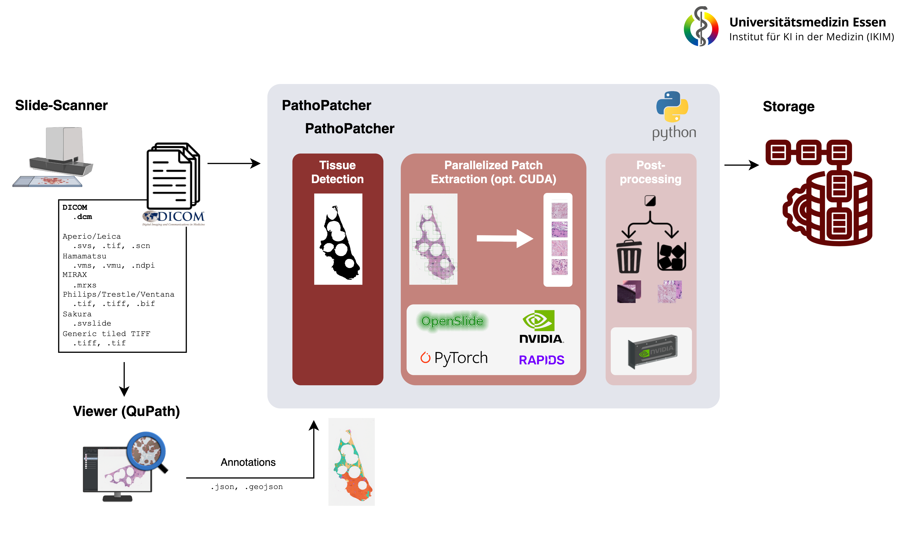

[](https://www.python.org/downloads/release/python-360/)
[](https://github.com/psf/black)

</a>
[](https://github.com/astral-sh/ruff)
[](https://www.codefactor.io/repository/github/tio-ikim/pathopatcher)
[](https://pepy.tech/projects/pathopatch)
___

# PathoPatch:
## Accelerating Artificial Intelligence Based Whole Slide Image Analysis with an Optimized Preprocessing Pipeline

<div align="center">

[Installation](#installation) • [Usage](#usage) • [Examples](#examples) • [Roadmap](#roadmap) • [Citation](#citation)

</div>

---
<p align="center">
  
</p>

---

## Installation

> [!CAUTION]
> Please use a Python Version smaller than 3.12, we recommend 3.10

### Prerequisite
1. Openslide (>= 3.4.1) needs to be installed (either directly https://openslide.org/download/ or via conda)<details>
        <summary>OpenSlide conda</summary>
        - Recommended: `conda install conda-forge::openslide=4.0.0` for DICOM support
        - Generic/minimum version: `conda-forge::openslide>=3.4.1`
      </details>
2. Openslide python: `pip install openslide-python`
3. Optional for speedup:

    - We recommend the following procedure to achieve to best speed-up:
        1. Install cupy for your cuda version, E.g., `pip install cupy-cuda12x` (CUDA >12.x) or `pip install cupy-cuda11x` (CUDA 11.0-11.8)
        2. Install cuCIM via pip: `pip install cucim`. We used the following version: `pip install cucim==23.6.0`
    - Not recommended but may be a helpful ressource if problems occur: [Official cuCIM installation instructions](https://github.com/rapidsai/cucim?tab=readme-ov-file#install-cucim)

### PIP-Package
The package can be found here: https://pypi.org/project/pathopatch/
Installation: `pip install pathopatch`

### Troubleshooting
- **torch**: If you get problems with torch, install it accordingly for your setup by follow this instructions: https://pytorch.org/get-started/previous-versions/. After you have installed pytorch, some packages might have get an update, therefore please reinstall pathopatch: `pip install --force-reinstall pathopatch`


### Development/from source
1. Clone the repository:
2. Create a conda environment with Python 3.10.12 version and install conda requirements: `conda env create -f environment.yaml -vv`. You can change the environment name by editing the `name` tag in the environment.yaml file.
This step is necessary, as we need to install `Openslide` with binary files. This is easier with conda. Otherwise, installation from [source](https://openslide.org/api/python/) needs to be performed and packages installed with pi
3. Activate environment: `conda activate pathopatch_env`
4. **Optional: cuCIM**
Run `conda install -c rapidsai cucim` inside your conda environment. This process is time consuming, so you should be patient. Also follow their [official guideline](https://github.com/rapidsai/cucim) if any problems occur.

### Commiting/Linting
1. Install pre-commit with `pre-commit install`
This activates pre-commit hooks, files are edited when commited and need to added again as they might change

## Usage
We provide different use cases - Offline-Dataset (Store on Disk :floppy_disk:) and Inference-Dataset for :zap: PyTorch :zap:

In our Pre-Processing pipeline, we are able to extract quadratic patches from detected tissue areas, load annotation files (`.json`) and apply color normlizations. We make use of the popular [OpenSlide](https://openslide.org/) library, but extended it with the [RAPIDS cuCIM](https://github.com/rapidsai/cucim) framework for a speedup in patch-extraction.

> We support all OpenSlide file formats + .dcm-File format (DICOM), by utilizing [`wsidicom`](https://github.com/imi-bigpicture/wsidicom) and [`wsidicomizer`](https://github.com/imi-bigpicture/wsidicomizer).

**Explanations for use cases :floppy_disk: vs :zap:**
<details>
  <summary>Offline-Dataset</summary>


  In general, our framework has the following commands registered in your shell:
  > **wsi_extraction**: Extract patches with specific configuration and store them on the disk
  > **annotation_conversion**: Can be used to convert annotations
  > **macenko_vector_generation**: To generate new macenko vectors for a new dataset, if custom vectors are tend to be used

  ### Parameter handover and CLI
  #### Option 1: Config.yaml
  Arguments are passed via CLIs. In addition to the CLI, also a configuration file can be passed via
  ```bash
  wsi_extraction --config path/to/config.yaml
  ```
  Exemplary configuration file: [patch_extraction.yaml](examples/patch_extraction.yaml).

  #### Option 2: CLI

  The CLI of the main script for patch extraction ([wsi_extraction](pathopatch/wsi_extraction.py)) is as follows:

  ```bash
  wsi_extraction [-h]
      [--wsi_paths WSI_PATHS]
      [--wsi_filelist WSI_FILELIST]
      [--output_path OUTPUT_PATH]
      [--wsi_extension {svs}]
      [--config CONFIG]
      [--patch_size PATCH_SIZE]
      [--patch_overlap PATCH_OVERLAP]
      [--target_mpp TARGET_MPP]
      [--target_mag TARGET_MAG]
      [--downsample DOWNSAMPLE]
      [--level LEVEL]
      [--context_scales [CONTEXT_SCALES ...]]
      [--check_resolution CHECK_RESOLUTION]
      [--processes PROCESSES]
      [--overwrite]
      [--annotation_paths ANNOTATION_PATHS]
      [--annotation_extension {json,xml}]
      [--incomplete_annotations]
      [--label_map_file LABEL_MAP_FILE]
      [--save_only_annotated_patches]
      [--save_context_without_mask]
      [--exclude_classes EXCLUDE_CLASSES]
      [--store_masks]
      [--overlapping_labels]
      [--normalize_stains]
      [--normalization_vector_json NORMALIZATION_VECTOR_JSON]
      [--min_intersection_ratio MIN_INTERSECTION_RATIO]
      [--tissue_annotation TISSUE_ANNOTATION]
      [--tissue_annotation_intersection_ratio TISSUE_ANNOTATION_INTERSECTION_RATIO]
      [--masked_otsu]
      [--otsu_annotation OTSU_ANNOTATION]
      [--filter_patches FILTER_PATCHES]
      [--apply_prefilter APPLY_PREFILTER]
      [--log_path LOG_PATH]
      [--log_level {critical,error,warning,info,debug}]
      [--hardware_selection {cucim,openslide,wsidicom}]
      [--wsi_magnification WSI_MAGNIFICATION]
      [--wsi_mpp WSI_MPP]

  options:
    -h, --help            show this help message and exit
    --wsi_paths WSI_PATHS
                          Path to the folder where all WSI are stored or path to a
                          single WSI-file. (default: None)
    --wsi_filelist WSI_FILELIST
                          Path to a csv-filelist with WSI files (separator: `,`), if
                          provided just these files are used.Must include full paths
                          to WSIs, including suffixes.Can be used as an replacement
                          for the wsi_paths option.If both are provided, yields an
                          error. (default: None)
    --output_path OUTPUT_PATH
                          Path to the folder where the resulting dataset should be
                          stored. (default: None)
    --wsi_extension {svs,tiff,tif,bif,scn,ndpi,vms,vmu}
                          The extension types used for the WSI files, the options
                          are: ['svs', 'tiff', 'tif', 'bif', 'scn', 'ndpi', 'vms',
                          'vmu'] (default: None)
    --config CONFIG       Path to a config file. The config file can hold the same
                          parameters as the CLI. Parameters provided with the CLI are
                          always having precedence over the parameters in the config
                          file. (default: None)
    --patch_size PATCH_SIZE
                          The size of the patches in pixel that will be retrieved
                          from the WSI, e.g. 256 for 256px (default: None)
    --patch_overlap PATCH_OVERLAP
                          The percentage amount pixels that should overlap between
                          two different patches. Please Provide as integer between 0
                          and 100, indicating overlap in percentage. (default: None)
    --target_mpp TARGET_MPP
                          If this parameter is provided, the output level of the WSI
                          corresponds to the level that is at the target microns per
                          pixel of the WSI. Alternative to target_mag, downsaple and
                          level. Highest priority, overwrites all other setups for
                          magnifcation, downsample, or level. (default: None)
    --target_mag TARGET_MAG
                          If this parameter is provided, the output level of the WSI
                          corresponds to the level that is at the target
                          magnification of the WSI. Alternative to target_mpp,
                          downsaple and level. High priority, just target_mpp has a
                          higher priority, overwrites downsample and level if
                          provided. (default: None)
    --downsample DOWNSAMPLE
                          Each WSI level is downsampled by a factor of 2, downsample
                          expresses which kind of downsampling should be used with
                          respect to the highest possible resolution. Medium
                          priority, gets overwritten by target_mag and target_mpp if
                          provided, but overwrites level. (default: None)
    --level LEVEL         The tile level for sampling, alternative to downsample.
                          Lowest priority, gets overwritten by target_mag and
                          downsample if they are provided. (default: None)
    --context_scales [CONTEXT_SCALES ...]
                          Define context scales for context patches. Context patches
                          are centered around a central patch. The context-patch size
                          is equal to the patch-size, but downsampling is different
                          (default: None)
    --check_resolution CHECK_RESOLUTION
                          If a float value is supplies, the program checks whether
                          the resolution of all images corresponds to the given value
                          (default: None)
    --processes PROCESSES
                          The number of processes to use. (default: None)
    --overwrite           Overwrite the patches that have already been created in
                          case they already exist. Removes dataset. Handle with care!
                          (default: None)
    --annotation_paths ANNOTATION_PATHS
                          Path to the subfolder where the XML/JSON annotations are
                          stored or path to a file (default: None)
    --annotation_extension {json}
                          The extension types used for the annotation files, the
                          options are: ['json'] (default: None)
    --incomplete_annotations
                          Set to allow WSI without annotation file (default: None)
    --label_map_file LABEL_MAP_FILE
                          The path to a json file that contains the mapping between
                          the annotation labels and some integers; an example can be
                          found in examples (default: None)
    --save_only_annotated_patches
                          If true only patches containing annotations will be stored
                          (default: None)
    --save_context_without_mask
                          This is helpful for extracting patches, that are not within
                          a mask, but needed for the Valuing Vicinity Segmentation
                          Algorithms. This flag is specifically helpful if only fully
                          annotated patches should be extracted from a region of
                          interest (ROI) and their masks are stored, but also
                          sourrounding neighbourhood patches (without mask) are
                          needed. (default: None)
    --exclude_classes EXCLUDE_CLASSES
                          Can be used to exclude annotation classes (default: None)
    --store_masks         Set to store masks per patch. Defaults to false (default:
                          None)
    --overlapping_labels  Per default, labels (annotations) are mutually exclusive.
                          If labels overlap, they are overwritten according to the
                          label_map.json ordering (highest number = highest priority)
                          (default: None)
    --normalize_stains    Uses Macenko normalization on a portion of the whole slide
                          image (default: None)
    --normalization_vector_json NORMALIZATION_VECTOR_JSON
                          The path to a JSON file where the normalization vectors are
                          stored (default: None)
    --adjust_brightness   Normalize brightness in a batch by clipping to 90 percent.
                          Not recommended, but kept for legacy reasons (default:
                          None)
    --min_intersection_ratio MIN_INTERSECTION_RATIO
                          The minimum intersection between the tissue mask and the
                          patch. Must be between 0 and 1. 0 means that all patches
                          are extracted. (default: None)
    --tissue_annotation TISSUE_ANNOTATION
                          Can be used to name a polygon annotation to determine the
                          tissue area. If a tissue annotation is provided, no Otsu-
                          thresholding is performed (default: None)
    --tissue_annotation_intersection_ratio TISSUE_ANNOTATION_INTERSECTION_RATIO
                          Intersection ratio with tissue annotation. Helpful, if ROI
                          annotation is passed, which should not interfere with
                          background ratio. If not provided, the default
                          min_intersection_ratio with the background is used.
                          (default: None)
    --masked_otsu         Use annotation to mask the thumbnail before otsu-
                          thresholding is used (default: None)
    --otsu_annotation OTSU_ANNOTATION
                          Can be used to name a polygon annotation to determine the
                          area for masked otsu thresholding. Seperate multiple labels
                          with ' ' (whitespace) (default: None)
    --filter_patches      Post-extraction patch filtering to sort out artefacts,
                          marker and other non-tissue patches with a DL model. Time
                          consuming. Defaults to False. (default: None)
    --apply_prefilter     Pre-extraction mask filtering to remove marker from mask
                          before applying otsu. Defaults to False. (default: None)
    --log_path LOG_PATH   Path where log files should be stored. Otherwise, log files
                          are stored in the output folder (default: None)
    --log_level {critical,error,warning,info,debug}
                          Set the logging level. Options are ['critical', 'error',
                          'warning', 'info', 'debug'] (default: None)
    --hardware_selection {cucim,openslide,wsidicom}
                          Select hardware device (just if available, otherwise always
                          cucim). Defaults to None. (default: None)
    --wsi_magnification WSI_MAGNIFICATION
                          Manual WSI magnification, but just applies if metadata
                          cannot be derived from OpenSlide (e.g., for .tiff files).
                          (default: None)
    --wsi_mpp WSI_MPP     Manual WSI MPP, but just applies if metadata cannot be
                          derived from OpenSlide (e.g., for .tiff files). (default:
                          None)
  ```
  #### Option 3: CLI + Config
  Both can be combined, but arguments in the CLI have precedence!
</details>

<details>
  <summary>Inference-Dataset (PyTorch)</summary>
  TBD, Elements: LivePatchWSIConfig, LivePatchWSIDataset, LivePatchWSIDataloader [Link](pathopatch/patch_extracton/dataset.py)

  Usage:
  ```python
  patch_config = LivePatchWSIConfig(
    wsi_path="/Users/fhoerst/Fabian-Projekte/Selocan/RicardoScans/266819.svs",
    patch_size=256,
    patch_overlap=0,
    target_mpp=0.3,
    target_mpp_tolerance=0.1,
  )
  patch_dataset = LivePatchWSIDataset(patch_config, logger)
  patch_dataloader = LivePatchWSIDataloader(patch_dataset, batch_size=8)
  for batch in patch_dataloader:
    ...
  ```
</details>

#### Helpful ressources
<details>
  <summary>Label-Map</summary>

  An exemplary `label_map.json` file is shown below. It is important that the background label always has a 0 assigned as integer value

  Example:
  ```json
  {
      "Background": 0,
      "Tissue-Annotation": 1,
      "Tumor": 2,
      "Stroma": 3,
      "Necrosis": 4
  }
  ```
</details>

<details>
  <summary>Precedence of Target-Magnification, Downsampling and Level</summary>


  Target_mpp has the highest priority. If all four are passed, always the target mpp is used for output. Level has the lowest priority.
  Sorted by priority:

  - Target microns per pixel: Overwrites all other selections
  - Target magnification: Overwrites downsampling and level
  - Downsampling: Overwrites level
  - Level: Lowest priority, default used when neither target magnification nor downsampling is passed
</details>

### Resulting Dataset Structure :floppy_disk:
<details>
  <summary>Collapse Structure</summary>

  In general, the folder structure for a preprocessed dataset looks like this:

  ```bash
  WSI_Name
  ├── annotation_masks      # thumbnails of extracted annotation masks
  │   ├── all_overlaid.png  # all with same dimension as the thumbnail
  │   ├── tumor.png
  │   └── ...  
  ├── context               # context patches, if extracted
  │   ├── 2                 # subfolder for each scale
  │   │   ├── WSI_Name_row1_col1_context_2.png
  │   │   ├── WSI_Name_row2_col1_context_2.png
  │   │   └── ...
  │   └── 4
  │   │   ├── WSI_Name_row1_col1_context_2.png
  │   │   ├── WSI_Name_row2_col1_context_2.png
  │   │   └── ...
  ├── masks                 # Mask (numpy) files for each patch -> optional folder for segmentation
  │   ├── WSI_Name_row1_col1.npy
  │   ├── WSI_Name_row2_col1.npy
  │   └── ...
  ├── metadata              # Metadata files for each patch
  │   ├── WSI_Name_row1_col1.yaml
  │   ├── WSI_Name_row2_col1.yaml
  │   └── ...
  ├── patches               # Patches as .png files
  │   ├── WSI_Name_row1_col1.png
  │   ├── WSI_Name_row2_col1.png
  │   └── ...
  ├── thumbnails            # Different kind of thumbnails
  │   ├── thumbnail_mpp_5.png
  │   ├── thumbnail_downsample_32.png
  │   └── ...
  ├── tissue_masks          # Tissue mask images for checking
  │   ├── mask.png          # all with same dimension as the thumbnail
  │   ├── mask_nogrid.png
  │   └── tissue_grid.png
  ├── mask.png              # tissue mask with green grid  
  ├── metadata.yaml         # WSI metdata for patch extraction
  ├── patch_metadata.json   # Patch metadata of WSI merged in one file
  └── thumbnail.png         # WSI thumbnail
  ```
</details>

## A Note on DICOM
If you use DICOM files directly converted by vendors, first try to use OpenSlide which is the default setting. If this is slow, you could try to enforce the `wsidicom` image loader by setting the hardware to "wsidicom" (`hardware_selection: wsi_dicom`or `--hardware_selection wsidicom`) and check if this works.

If you converted files to DICOM with the `wsidicomizer` tool as explained below, please always set the image loader to "wsidicom" (`hardware_selection: wsi_dicom`or `--hardware_selection wsidicom`).

## Examples
An example notebook is given [here](PathoPatch.ipynb):
<a href="https://colab.research.google.com/github/TIO-IKIM/PathoPatcher/blob/main/PathoPatch.ipynb" target="_parent"></a>

### Example config files
Example config files for various use-cases can be found in the [test database](tests/static_test_files/preprocessing) (tests/static_test_files/preprocessing)

### DICOM-conversion
To convert WSI-Files into DICOM-Format, please follow [this documentation](docs/DICOM.md)

### Filelist with metadata
See here: [examples/filelist.csv](examples/filelist.csv)

```csv
path,slide_mpp,magnification
./test_database/input/WSI/CMU-1.svs,0.500,20
```
Only the path is enforced, other two cols are optional.

## Roadmap
- :construction: In-memory inference loader - This feature is currently under development -  an unstable version is already online. Once completed, it will allow a dataset to be loaded into memory for inference, eliminating the need to store it on disk. Useful for inference

- :soon: More test cases

- :soon: More examples

## License
<p xmlns:cc="http://creativecommons.org/ns#" xmlns:dct="http://purl.org/dc/terms/"><a property="dct:title" rel="cc:attributionURL" href="https://github.com/TIO-IKIM/PathoPatcher">PathoPatcher</a> by <a rel="cc:attributionURL dct:creator" property="cc:attributionName" href="https://github.com/FabianHoerst">Fabian Hörst, University Hospital Essen,</a> is licensed under <a href="http://creativecommons.org/licenses/by-nc-sa/4.0/?ref=chooser-v1" target="_blank" rel="license noopener noreferrer" style="display:inline-block;">CC BY-NC-SA 4.0

  </a></p>

## Citation
```latex
@InProceedings{10.1007/978-3-658-44037-4_91,
    author="H{\"o}rst, Fabian
            and Schaheer, Sajad H.
            and Baldini, Giulia
            and Bahnsen, Fin H.
            and Egger, Jan
            and Kleesiek, Jens",
    editor="Maier, Andreas
            and Deserno, Thomas M.
            and Handels, Heinz
            and Maier-Hein, Klaus
            and Palm, Christoph
            and Tolxdorff, Thomas",
    title="Accelerating Artificial Intelligence-based Whole Slide Image Analysis with an Optimized Preprocessing Pipeline",
    booktitle="Bildverarbeitung f{\"u}r die Medizin 2024",
    year="2024",
    publisher="Springer Fachmedien Wiesbaden",
    address="Wiesbaden",
    pages="356--361",,
    isbn="978-3-658-44037-4"
}
```

### Acknowledgement
For processing DICOM-files, this work relies on the IMI-Bigpicture [`wsidicom`](https://github.com/imi-bigpicture/wsidicom) and [`wsidicomizer`](https://github.com/imi-bigpicture/wsidicomizer) libraries, with the following acknowledgements:

>wsidicom: Copyright 2021 Sectra AB, licensed under Apache 2.0.
This project is part of a project that has received funding from the Innovative Medicines Initiative 2 Joint Undertaking under grant agreement No 945358. This Joint Undertaking receives support from the European Union’s Horizon 2020 research and innovation programme and EFPIA. IMI website: <www.imi.europa.eu>

>wsidicomizer: Copyright 2021 Sectra AB, licensed under Apache 2.0.
This project is part of a project that has received funding from the Innovative Medicines Initiative 2 Joint Undertaking under grant agreement No 945358. This Joint Undertaking receives support from the European Union’s Horizon 2020 research and innovation programme and EFPIA. IMI website: <www.imi.europa.eu>
